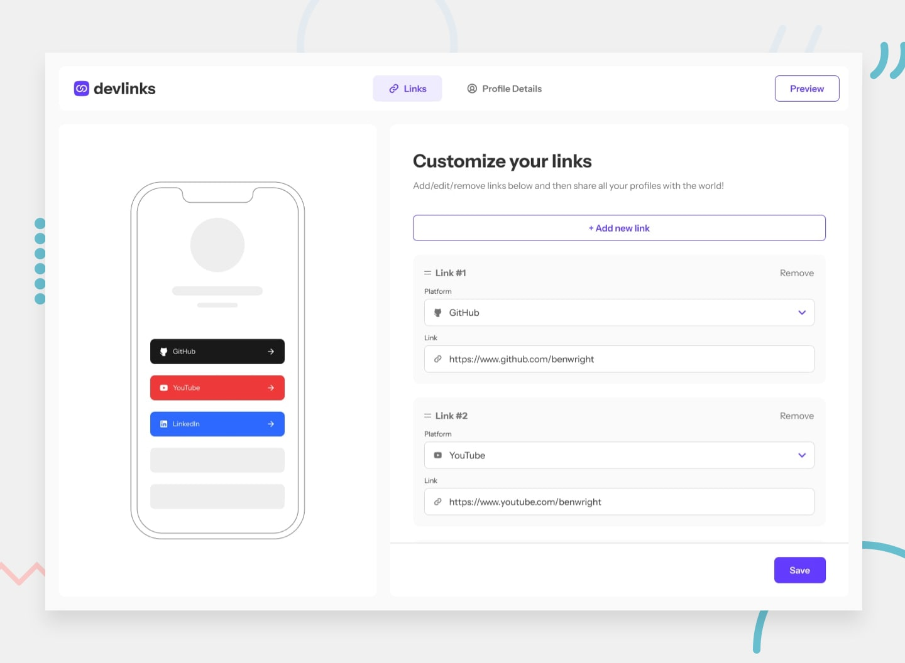

# Link Sharing App

## Table of contents

- [Overview](#overview)
  - [The challenge](#the-challenge)
  - [Screenshot](#screenshot)
  - [Links](#links)
- [My process](#my-process)
  - [Built with](#built-with)
  - [Useful resources](#useful-resources)
- [Author](#author)
- [Acknowledgments](#acknowledgments)

## Overview

### The challenge

Users should be able to:

- View the optimal layout for each page depending on their device's screen size
- See hover states for all interactive elements throughout the site
- Registration and Authorization
- Upload Personal Info
- Copy links and share them

### Screenshot



### Getting Started

1. First of all you need to clone app repository from github:

```
git clone git@github.com:beqa200/other-side.git
```

2. Next step requires to start live server.

### Links

- Solution URL: [Github](https://github.com/beqa200/other-side)
- Live Site URL: [Vercel](https://other-side.vercel.app/)

## My process

### Built with

- Semantic HTML5 markup
- CSS custom properties
- Flexbox
- Mobile-first workflow
- JavaScript
- Localstorage

### Useful resources

- [w3schools](https://www.w3schools.com/) - This web-page helped us to dig deeper into HTML and CSS, and improve number of issues in this direction. We really liked this web-page and will use it in the future as well.
- [developer.mozilla](https://developer.mozilla.org/en-US/) - This is an amazing web-page which gave us in-depth knowledge in JavaScript language. We'd recommend it to anyone still learning this language.
- [stackoverflow](https://stackoverflow.com/) - This is an amazing web-page where you can ask any technical question about speciefic issue and other developers will help you to solve the problem. Their Q&A platform is a great tool to find the right answer for your project. We highly recommend this web-page for other developers.

## Author

- Linkedin- [Giorgi Dzneladze](https://www.linkedin.com/in/giorgi-dzneladze/)
- Linkedin - [Luka Janelidze](https://www.linkedin.com/in/luka-janelidze-a04874248/)
- Linkedin - [David Mikeladze](https://www.linkedin.com/in/david-mikeladze-927406264/)

## Acknowledgments

We would like to give a big credit to our mentor, [Beqa Maisuradze](https://www.linkedin.com/in/beka-maisuradze-76a730234/) who helped us to solve many issues during this project.